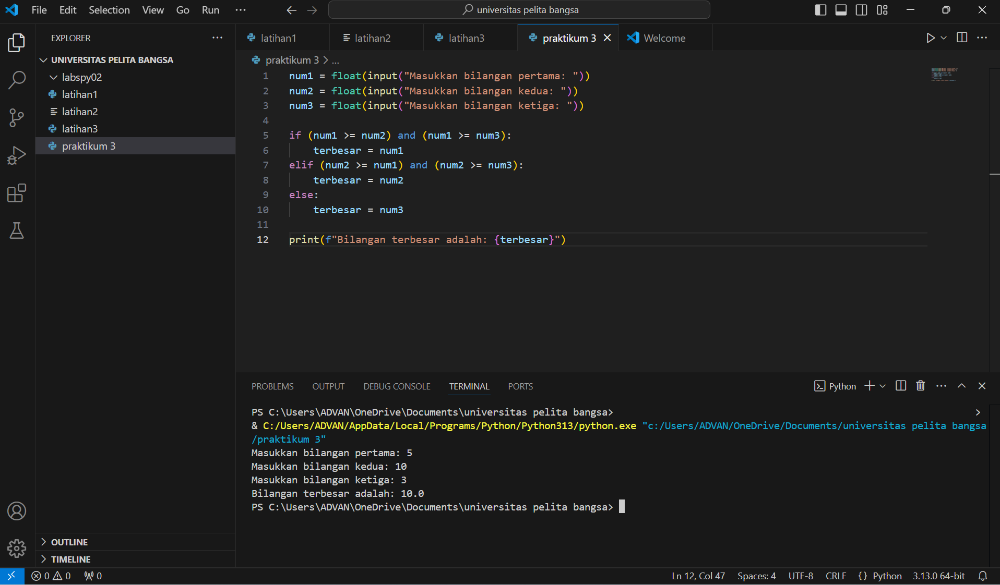

# labspy02

Tugas praktikum 3

Nama : Zico Rizky Febrian

Nim : 352310880

Kelas : IE.23 C.12

## membandingkan 3 bilangan
mencari bilangan terbesar dari 3 bilangan

## screenshots

## Langkah langkah algoritme

Langkah 1: Input dari Pengguna

•	Program meminta pengguna untuk memasukkan tiga bilangan menggunakan float(input()). Dengan float, program dapat menerima bilangan bulat maupun desimal.

 Langkah 2: Logika untuk Menentukan Bilangan Terbesar
 
•	Menggunakan struktur if-elif-else untuk membandingkan tiga bilangan.
•	Kondisi pertama memeriksa apakah num1 lebih besar atau sama dengan num2 dan num3. Jika benar, num1 adalah bilangan terbesar.
•	Jika kondisi pertama salah, kondisi kedua memeriksa apakah num2 lebih besar atau atau sama dengan num2 dan num3. Jika benar, num1 adalah bilangan terbesar.
•	Jika kondisi pertama salah, kondisi kedua memeriksa apakah num2 lebih besar atau sama dengan num1 dan num3. Jika benar, num2 adalah bilangan terbesar.
•	Jika kedua kondisi di atas salah, maka num3 adalah bilangan terbesar.
 Langkah 3: Output
•	Program mencetak bilangan terbesar menggunakan f-string untuk format output yang rapi.

## Flowerchat

